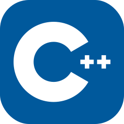

<h1>Hello There! 👋</h1>

<h3>Welcome to my page!</h3>

  My name is Roman, and I hail from  <b>Russian Federation</b>.
   I'm an information systems specialist and an ethical hacker.
   My primary work revolves around backend software development, though I also have a keen interest in frontend development.
   I'm involved in crafting applications for both desktop and mobile devices across various platforms, specializing in Android and iOS for mobile.
   Additionally, I specialize in designing information systems and drafting requirement specifications.
   I'm deeply involved in the development of neural networks.

<h1>👩🏻‍💻 Primary Languages</h1>

  
  
  
  
  
  
  
  

<h1>👩🏻‍💻 Secondary Languages</h1>

  
  
  
  
  
  

<h1>⚙️ DevOps and Version Control Systems</h1>

  
  
  

<h1>⚙️ Build and Package Systems</h1>

  
  
  

<h1>⚙️ Runtimes and Platforms</h1>

  
  

<h1>⚙️ Database Management Systems</h1>

  
  
  
  

<h1>⚙️ Web Frameworks and Libraries</h1>

  
  
  

<h1>⚙️ Image Processing and Computer Vision Libraries</h1>

  
  

<h1>⚡ IDE</h1>

  
  
  
  
  
  
  
  

<h1>📈 GitHub Stats</h1>

  
  

<h1>💬 Contacts</h1>

    
    

